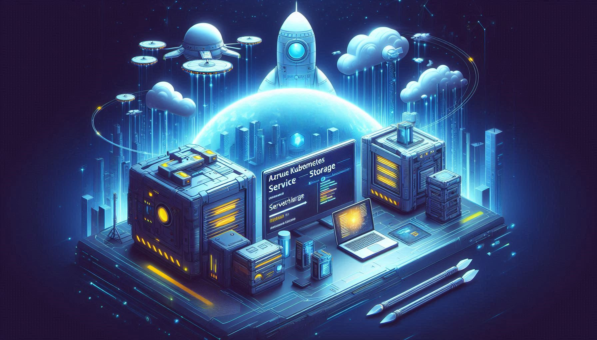

### Azure Kubernetes Services (AKS) - Storage Deep Dive (Lvl 300) 

Repo with all the content needed for the AKS Storage Deep Dive session.


<small> Image generated by AI

## Table of Contents
1. [Pre-Requirements](#1-pre-requirements)
2. [Environment Setup](#2-environment-setup)
3. [Lab 1: Provision/enable CSI Storage Drivers and Expand Without Downtime](Labs/Lab1.md)
4. [Lab 2: Provision/enable Azure Elastic SAN in an existing AKS Cluster using iSCSI CSI driver](Labs/Lab2.md)
5. [Lab 3: Provision/enable Azure Container Storage in an AKS Cluster and Stress Testing](Labs/Lab3.md)
6. [Lab 4: Manage and expand Ephemeral storage](Labs/Lab4.md)
7. [Lab 5: Provision/enable NetApp Files NFS volumes, SMB volumes and dual-protocol volumes](Labs/Lab5.md)
8. [Lab 6: Provision/enable NVMe PV in AKS Nodepool](Labs/Lab6.md)
9. [Lab 7: Configure Backup on a cluster and how to use Resource Modification to patch backed-up](Labs/Lab7.md)

## 1. Pre-Requirements
- **Azure Subscription** - [Signup for a free account.](https://azure.microsoft.com/free/)
- **Visual Studio Code** - [Download it for free.](https://code.visualstudio.com/download)
- **GitHub Account** - [Signup for a free account.](https://github.com/signup)
- **AKS Cluster** - [Learn about the Service.](https://azure.microsoft.com/en-us/products/kubernetes-service)
- **Azure CLI** - [Download it for free.](https://docs.microsoft.com/en-us/cli/azure/install-azure-cli)

## 2. Environment Setup
### 2.1. Create Azure resources

In this step, we'll **provision Azure resources** for our Lab, and put it ready to use.
- AKS (Azure Kubernetes Services) - CNI Overlay Network Plugin & Standard API

### Run this Lab with GitHub Codespaces

This repo also includes [DevContainer configuration](./.devcontainer/devcontainer.json), so you can open the repo using [GitHub Codespaces](https://docs.github.com/en/codespaces/overview). This will allow you to run all these Lab exercises, without having to install or having any extension being used on your local machine. When the Codespace is created, you can run the steps using the same instructions as below.

This is an optional step, and you can skip it if you want to run the Labs on your local machine.

### 2.2. Prepare the local environment (Local Machine or GitHub Codespaces)

Please check the **[pre-requisites](pre-requisites.md)** file for the setup of the environment.

After running all the pre-requisites, please follow the below steps

### 2.2.1. Clone the repository (Local Machine only)

```poweshell
git clone https://github.com/marconsilva/aks-storage-deepdive.git
cd aks-storage-deep-dive
```

### 2.2.2. Login into the cluster
```powershell
#login into the AKS Cluster
az account set --subscription $SUBSCRIPTION_ID
az aks get-credentials --resource-group $RESOURCE_GROUP --name $CLUSTER --overwrite-existing
```

### 2.2.3. Create a namespace for the Labs

```powershell
# create the namespace where the demo app will be deployed
kubectl create ns aksappga
```

Congratulations! You have successfully deployed a plain old AKS Cluster, and have a working cluster for running the AKS Storage Deep Dive Labs.


